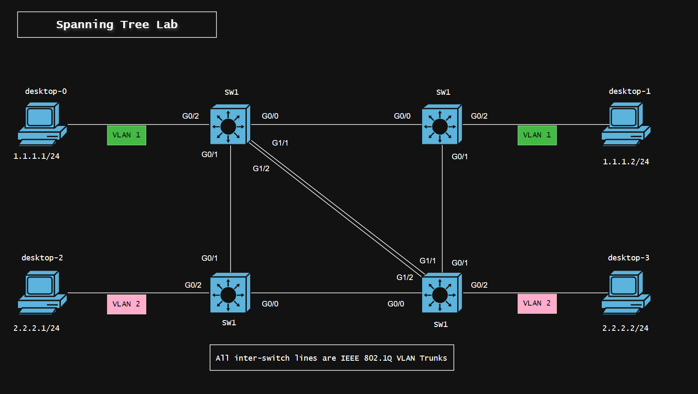

# Configuring Spanning Tree Protocol
 
Spanning Tree Protcol is enabled by default on most new Cisco switches. But we can manuplate the role of each switch based of our network design.

## Spanning Tree Protocol Lab Design

STP lab design uses four cisco switches, all switches are connected in mess envirement. This design shows loop in the topology, packets sent by desktop-0 will be broadcasted to in it's own domain (vlan 1).

