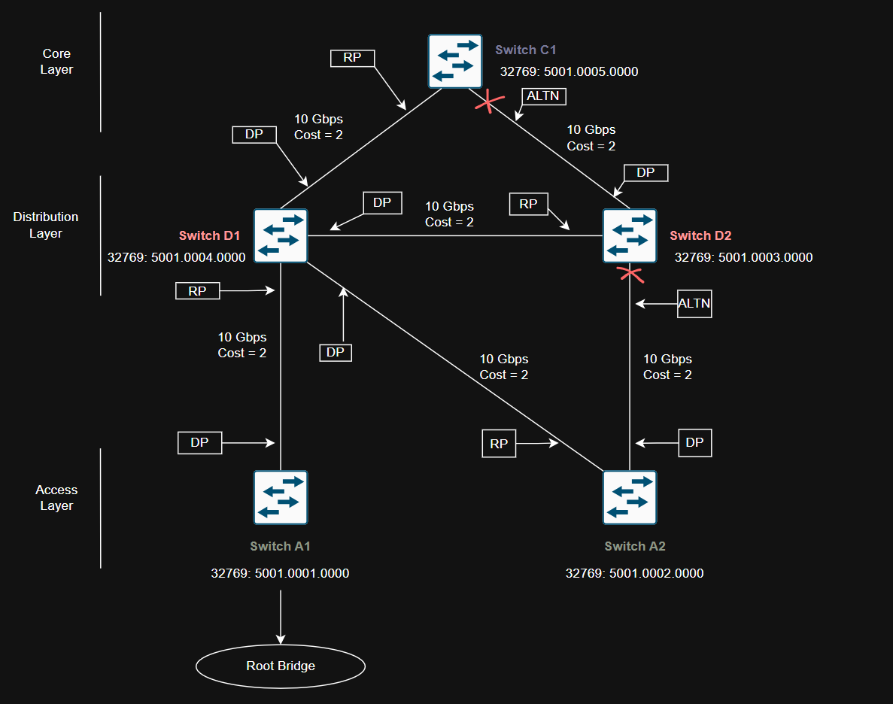

## Root Bridge Placement

The root bridge election is based on the two ideas;

1. One switch that is chosen as common reference point, and all other switches choose ports that have the best-cost path to root.

2. The root bridge become a central hub that interconnects other legs of the network. Thereforce, the root bridge can handle heavy switching load in its central location.

If the root bridge election is left to its default state, several things can occur to result in a poor choice.

For example, the *slowest* switch could be elected as the root bridge. If heavy traffic loads are expected to pass through the root bridge, the slowest switch is not the ideal candidate.

## Campus Network Design with Inefficent STP design (on purpose)

This is a three tier campus network with reduandancy links on all switches expect one. Imagine if all switches are left at their default states, only one root bridge is elected, with no clear choice for backup. In the event of root bridge fails, the process of root election will happen again, however the next root bridge may not the ideal switch or at ideal location selected.



This campus network design and switch placement based of their Bridge ID is designed purposely to create a inefficent spanning-tree strcutre to show how improper spanning-tree archtecture can cause issues for traffic.

Network diagram shows Access layer **Switch A1** becomes root bridge based of lowest bridge ID (bridge priority and MAC address) as compare to all other switches in the diagram. 

Inefficent Root Bridge placement can cause many issues but few that stands out the most.

 - Network traffic might have to take longer, less direct paths to reach the root bridge. This can slow things down and make the network less efficient.

- Root bridge becomes slow and overloaded can cause slow spanning-tree convergence means a longer outage time.

## Best Practice to Select Root Bridge

Design network with one switch as a primary root bridge and another switch as secondary root bridge to achieve high availabilty.

As a common practice, the primary root bridge and secondary root bridge should be placed near the center of the Layer 2 network. Distribution switches would make more sense to select as primary and secondary root bridge as most traffic is expected to pass through the distribution layer switches.

## Configuring Root Bridge

A Catalyst switch can be configured to use one of the following formats for its STP bridge ID:

 - Traditional 802.1D bridge priority value (16 bits), followed by the unique switch MAC address for the VLAN.

 - The 802.1t extended system ID (4-bit priority multiplier, plus a 12-bit VLAN ID), forllowing by a nonunique switch MAC address for the VLAN.

To see if switch already using the 802.1t extended system ID method, it can be varified from switches running-configuration:

```bash
Switch # show running-config | include spanning-tree extend system-id
```

You can also check the output of ```show spanning-tree``` command to see which method is used.

    - If the priority value is shown in the output will be **multiple of 4096 plus** the VLAN ID, STP is using **Extended System ID** method.
    - If the priority value displays  the exact **multiple of 4096**. The VLAN ID is not added to the priority field. This means STP is using the **Traditional 802.1D** method.

To enable extended system ID method, following command can be used on the global configuration level:

```bash
Switch(config) # spanning-tree extend system-id
```

Root bridge can be configured using two methods:

1. **Manual** - Bridge prioroty can be set manually by giving lower-than-default bridge ID value to win a root bridge election. Important to note - you must know the bridge priorities of all other swithhes in the same VLAN so that you can choose a value that is less than all the others.

The commad to manually maniuplate the bridge priority as follows?

```bash
Switch(config) # spanning-tree vlan *vlan-list* priority *bridge-priority*
```
By default *bridge-priority* value defaults to 32,768, however it can be statically assign from 0 to 65,535.

If switch has STP extended system ID is enabled, the default bridge-priority is 32,768 plus the VLAN number. In that case, the value can range from 0 to 61,440, but only as mutliples of 4096. A lower bridge priority is preferable.


